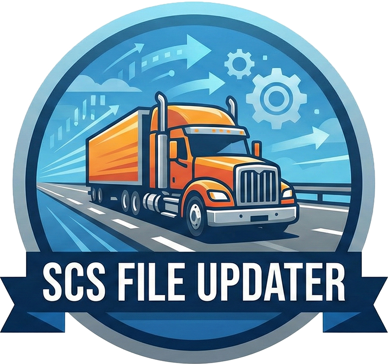

# SCS File Updater

Professional tool for Euro Truck Simulator 2 and American Truck Simulator modders.

# SCS File Updater

Quickly update the `compatible_versions` inside `.scs`, `.zip`, or `.rar` mod packages and get a correctly named output file.

## Features
- Drag & drop support
- Accepts precise versions (e.g., `1.57.*` or `1.58.*`)
- Always outputs a clean `.scs` file with version suffix
- Standalone Windows executable (no Python required)

## Usage
1. Run `SCS File Updater.exe`
2. Select or drag your your mod archive
3. Type the new version
4. Click **Update** to create a new .scs

The new file will appear in the same folder with `_vX_Y_Z` appended.

## Requirements
- [WinRAR](https://www.win-rar.com/download.html?&L=0) or [7zip](https://www.7-zip.org/download.html)

## Updates
- v1.0.1 - Allows multiple files to be updated at the same time
